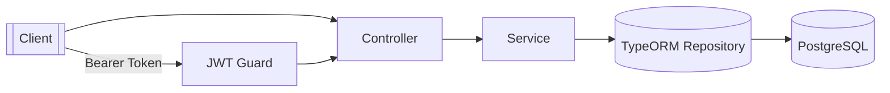
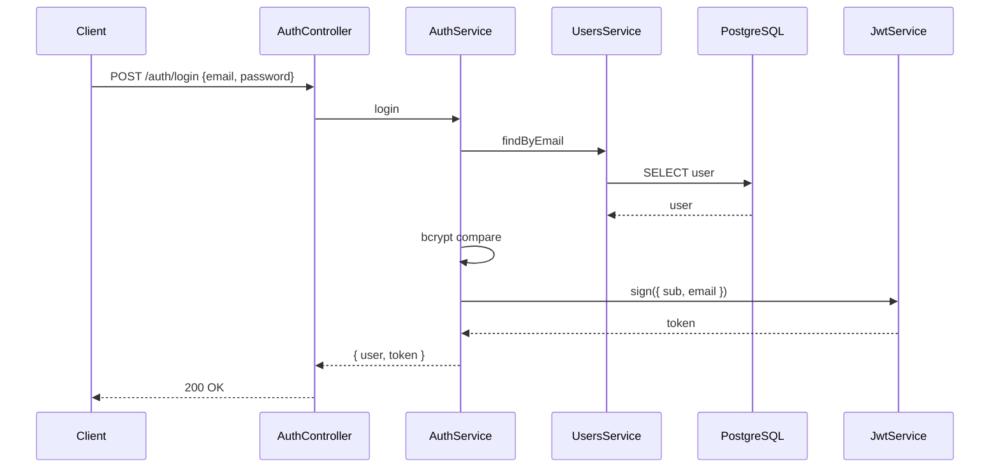
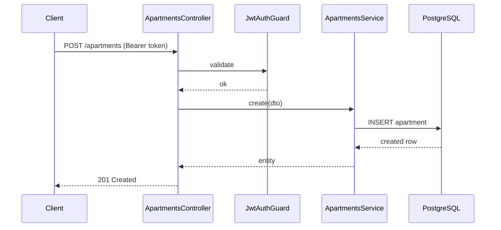
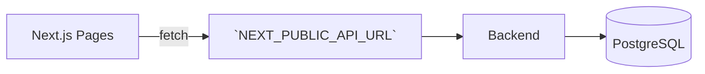
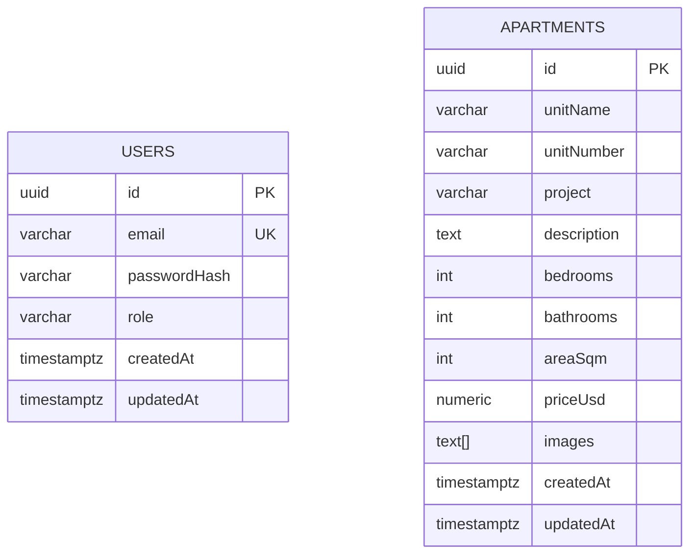
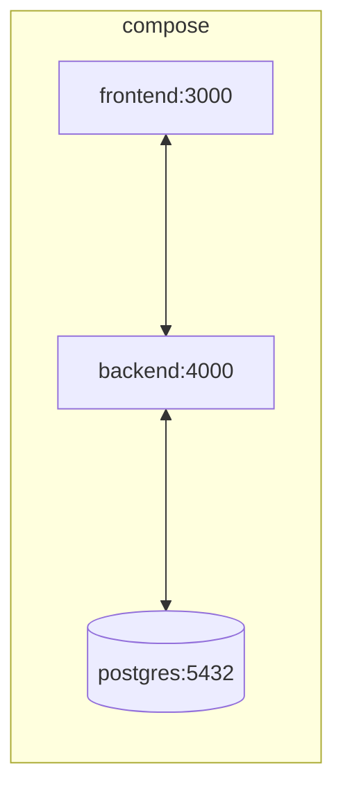

# Architecture

This document describes the system architecture for the Apartments application, including backend, frontend, and infrastructure design.

## High-Level Architecture
- Frontend (Next.js) calls the Backend (NestJS) via REST
- Backend persists data to PostgreSQL via TypeORM
- Docker Compose orchestrates the services

```mermaid
flowchart LR
  FE[Frontend (Next.js)] -->|HTTP| BE[Backend (NestJS)]
  BE --> DB[(PostgreSQL)]
```

## Backend Architecture
- Pattern: Modular monolith with layered design
  - Controller → Service → Repository (TypeORM) → Database
- Modules
  - `AuthModule`: JWT auth, register/login
  - `UsersModule`: user entity and service
  - `ApartmentsModule`: listing, details, creation
- Cross-cutting concerns
  - Validation (class-validator)
  - Swagger docs
  - Config via env
  - JWT Strategy/Guard (Passport)



### Key Sequences
Login flow:


Create apartment flow:


## Frontend Architecture
- Next.js 14 Pages Router
  - `src/pages/home.tsx`: hero + search
  - `src/pages/search.tsx`: projects aggregated from apartments with infinite scroll
  - `src/pages/search/[projectId]/*`: project and apartment details
  - `src/pages/sell.tsx`: sell form
- Styling: Tailwind CSS (responsive grid/cards)



## Database Architecture
- PostgreSQL with `pgcrypto` for `gen_random_uuid()`
- Migrations manage schema and indices
- Entities: `users`, `apartments`



## Deployment / Infra
- Docker Compose services
  - `db` (postgres:16-alpine) + healthcheck + volume
  - `backend` (NestJS) with env config and migrations
  - `frontend` (Next.js) production server


