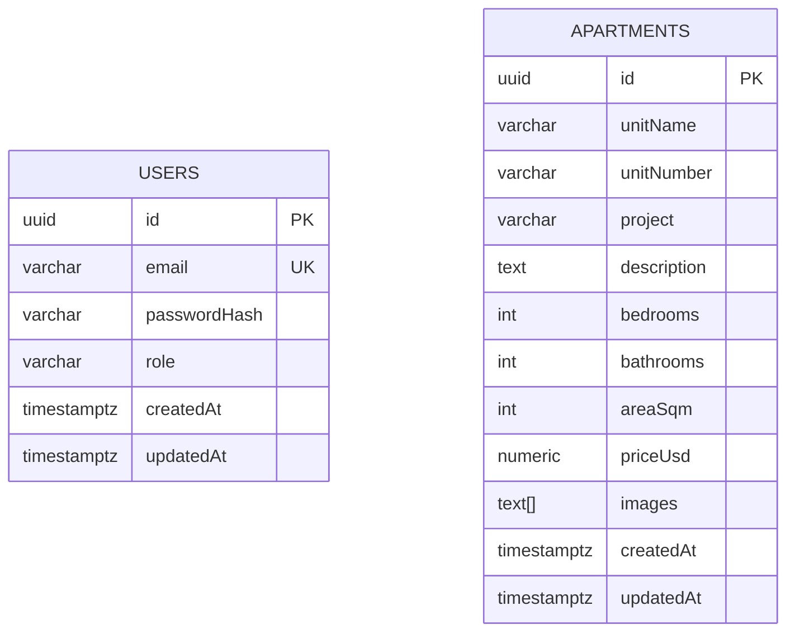

# Data Model

## ER Diagram

## Tables
### users
- `id` uuid PK default `gen_random_uuid()`
- `email` varchar(255) unique not null
- `passwordHash` varchar(255) not null (bcrypt)
- `role` varchar(20) default `user`
- `createdAt`, `updatedAt` timestamptz

### apartments
- `id` uuid PK default `gen_random_uuid()`
- `unitName` varchar(255) indexed
- `unitNumber` varchar(100) indexed
- `project` varchar(255) indexed
- `description` text nullable
- `bedrooms`, `bathrooms` int with defaults
- `areaSqm` int nullable
- `priceUsd` numeric(12,2) nullable
- `images` text[] default `{}`
- `createdAt`, `updatedAt` timestamptz

## Indices
- `apartments(unitName)`, `apartments(unitNumber)`, `apartments(project)`

## Migrations
- `1723795200000-enable-pgcrypto.ts`: enables `pgcrypto`
- `1723795200001-init-schema.ts`: creates `users` and `apartments` + indices

## Notes
- UUID generation uses `gen_random_uuid()` (pgcrypto)
- No foreign keys between users and apartments are required for this scope